# Using muOS on RG40XX H

## Downloading muOS for the RG40XX H

Before starting development, you need to install [**muOS**](https://muos.dev/) on your handheld device.

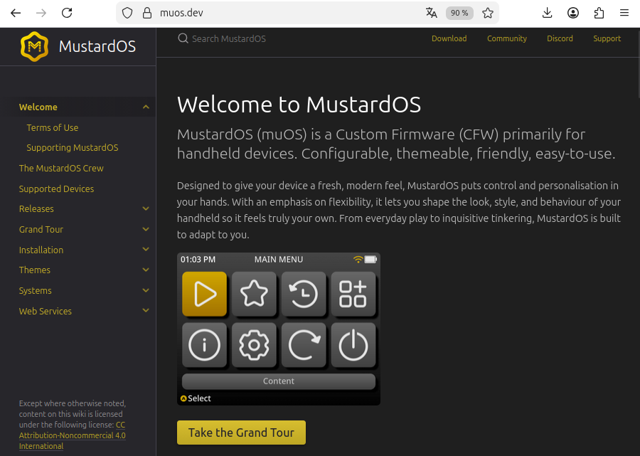

Download the appropriate version of **muOS for the RG40XX H** and prepare a microSD card dedicated to the operating system.

> Screenshot: muOS download page

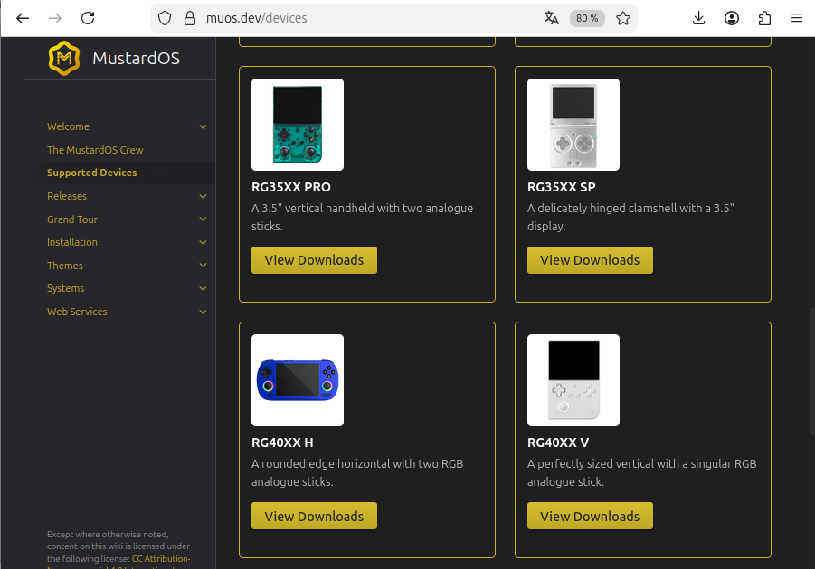

## Creating the microSD card with Balena Etcher

To install muOS on the microSD card, use **Balena Etcher**.

Steps:

1. Insert the microSD card into your PC.
2. Open **Balena Etcher**.
3. Select the downloaded muOS image file.
4. Select the microSD card as the target device.
5. Start the flashing process.
6. Wait until the process is completed.

> Screenshot: Balena Etcher configuration  
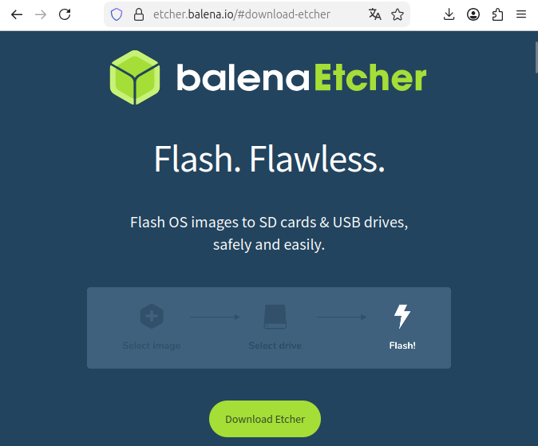

After the flashing process is finished, safely eject the microSD card and insert it into the RG40XX H.

## First boot installation

During the first startup, muOS will automatically complete its installation process on the microSD card.

The console will:

1. Expand and configure the system files.
2. Install the required components.
3. Reboot automatically when the installation is complete.

This first boot can take several minutes. Do not turn off the device during this process.

## Connecting muOS to the network

After the installation is complete, connect the RG40XX H to the Internet.

The easiest way is to use your smartphone as a Wi-Fi hotspot:

1. Enable the Wi-Fi hotspot on your phone.
2. Connect the RG40XX H to this Wi-Fi network.
3. Verify that the device has network access.

The network connection is required to remotely access the console from your development PC.

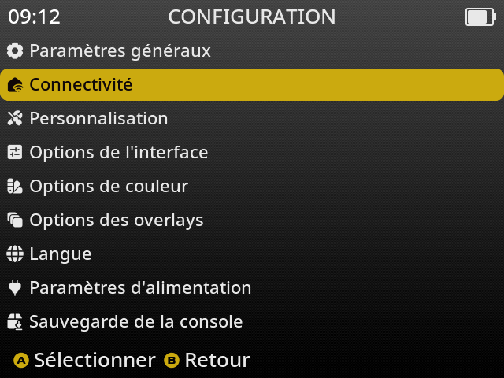

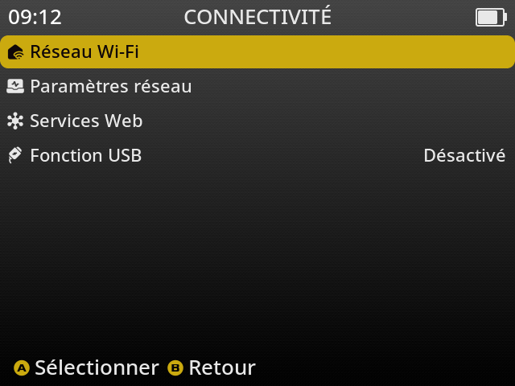

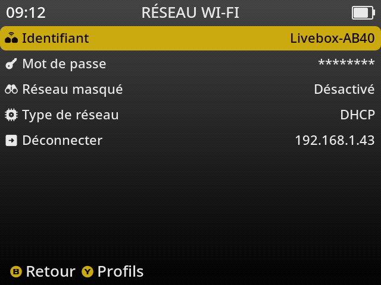

## Enable SSH and SCP access

To transfer files and remotely control the RG40XX H from your PC, enable:

- **SSH**: allows remote command-line access to the console.
- **SCP**: allows copying files between your PC and the console.

In the muOS settings menu:

1. Open the network or services configuration.
2. Enable **SSH**.
3. Enable **SCP**.

> Enable SSH option  Enable SCP option 

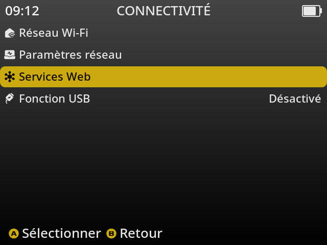

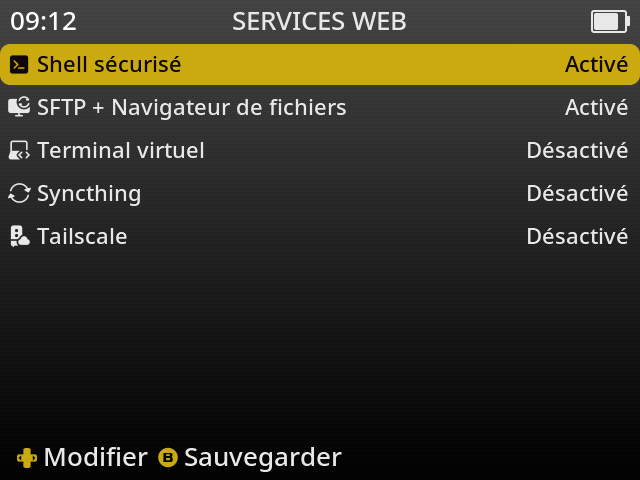

Once SSH and SCP are enabled, the RG40XX H can be accessed remotely from the development PC.

Example SSH connection:

```bash
ssh root@<RG40XX_IP_ADDRESS>
```

Example file transfer using SCP:

```bash
scp my_program root@<RG40XX_IP_ADDRESS>:/path/to/destination/
```

The RG40XX H is now ready to receive compiled applications from your development environment.

## Taking a screenshot and copying it to your PC

muOS includes a built-in screenshot feature that can be useful for documenting your application or capturing the current screen.

To take a screenshot:

1. Press **L2 + L1 + X** simultaneously.
2. The screenshot will be saved automatically on the SD card.

Screenshots are stored in:

```text
/mnt/mmc/MUOS/screenshot/
```

Example:

```bash
[/mnt/mmc/MUOS/screenshot]# ls
muOS_20260727_2042_0.png
```

To copy a screenshot from the RG40XX H to your development PC, use **SCP**:

```bash
scp root@<RG40XX_IP_ADDRESS>:/mnt/mmc/MUOS/screenshot/muOS_20260727_2042_0.png .
```

Replace `<RG40XX_IP_ADDRESS>` with the IP address of your RG40XX H.

The screenshot will be copied into the current directory on your PC.

## Using Nemo under Linux Mint

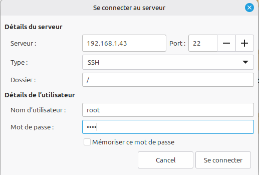

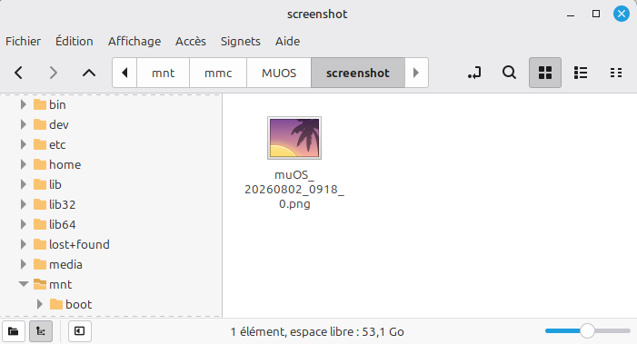

## Configuration menu

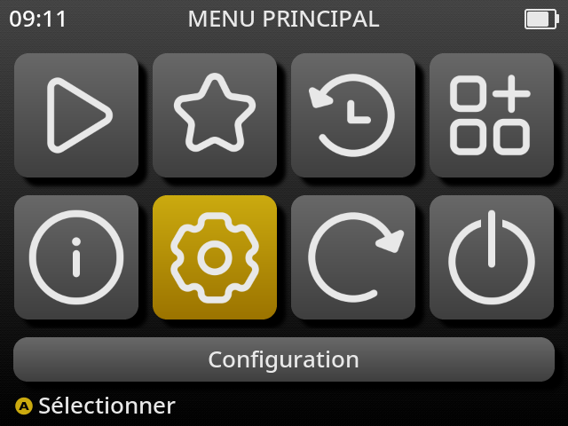

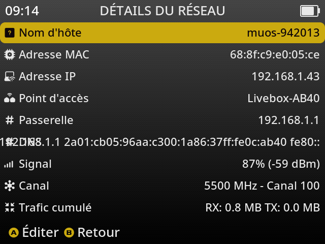

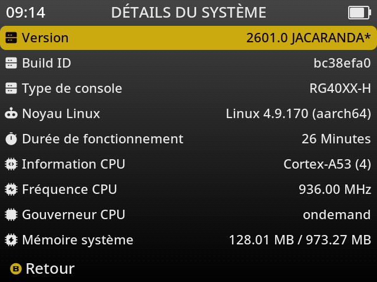

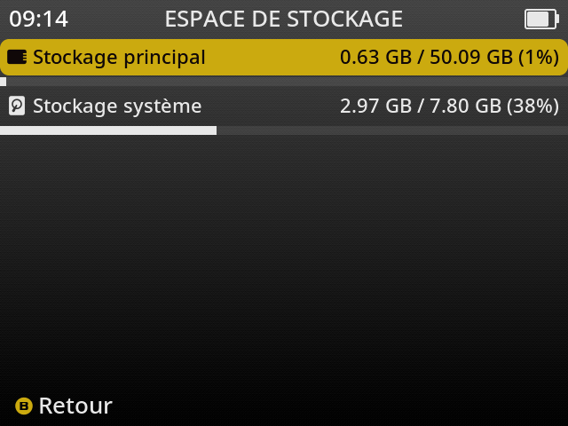

## Shutdown Anbernic

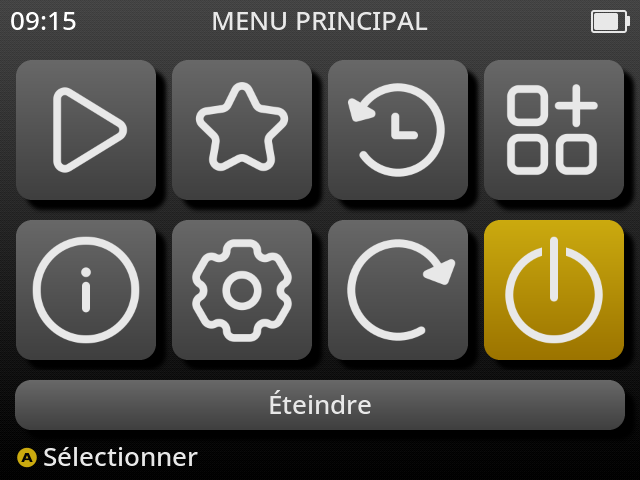
