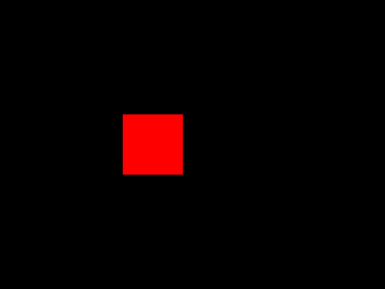

# Compilation of Applications for muOS

## Clone the development repository

The development examples and required files are available in the Git repository:

```bash
cd ~
git clone https://github.com/f4goh/anbernic
```

This command downloads the complete development environment into the `anbernic` directory inside your home folder.

The project contains:

- Example applications.
- SDL2 ARM64 libraries required for the Anbernic device.
- Source code and Makefiles used to build applications.

## Check the SDL2 libraries

The project contains an ARM64 version of the SDL2 SDK:

```
anbernic
└── SDL2-SDK-arm64
    ├── include
    │   └── SDL2
    │       ├── SDL.h
    │       ├── SDL_image.h
    │       ├── SDL_mixer.h
    │       └── ...
    └── lib
        ├── libSDL2.so
        ├── libSDL2_image.so
        ├── libSDL2_mixer.so
        ├── libSDL2_ttf.so
        └── ...
```

The `include/SDL2` directory contains the **header files** (`.h`) needed during compilation.

The `lib` directory contains the **shared libraries** (`.so`) required when running the application on the ARM64 device.

### Difference between PC SDL2 and ARM64 SDL2 libraries

The `.h` files are provided by the SDL2 development package installed on the PC:

```
/usr/include/SDL2
```

They describe the SDL2 functions available to the compiler.

The `.so` files come from the Anbernic ARM64 SDL2 SDK:

```
SDL2-SDK-arm64/lib
```

They are the compiled ARM64 libraries that will be loaded by the application when it runs on the handheld device.

The `.so` files are important because the Anbernic device cannot use the PC versions of SDL2 libraries. The application must be linked against ARM64-compatible libraries.

## Compile the Carrerouge example

Go to the example source directory:

```bash
cd ~/anbernic/src/Carrerouge
```

The directory contains:

```
main.c
Makefile
carrerouge.sh
mux_launch.sh
```

## Compile for the PC

Run:

```bash
make
```

Example output:

```bash
gcc main.c -I/usr/include/SDL2 -D_REENTRANT -lSDL2 -o carrerouge-pc
```

This command creates a version of the program that runs on the Linux development PC.

The generated file is:

```
carrerouge-pc
```

You can test the application directly on your computer.

## Compile for the Anbernic RG40XX H (ARM64)

Run:

```bash
make arm64
```

Example output:

```bash
aarch64-linux-gnu-gcc main.c \
-I../../SDL2-SDK-arm64/include \
-L../../SDL2-SDK-arm64/lib \
-lSDL2 \
-o carrerouge-arm64
```

This command uses the ARM64 cross compiler and creates a binary compatible with the Anbernic device running muOS.

The generated file is:

```
carrerouge-arm64
```

## Check the generated files

Run:

```bash
ls
```

Example result:

```
carrerouge-arm64
carrerouge-pc
main.c
Makefile
mux_launch.sh
```

## The mux_launch.sh file

The file:

```
mux_launch.sh
```

is the launcher script used by **muOS** to start the application on the Anbernic RG40XX H.

It is responsible for preparing the execution environment and launching the ARM64 program correctly inside muOS.

The use of `mux_launch.sh`, the file permissions, and the installation of the application on the Anbernic device are explained in the next chapter:

[Execution of the program in muOS](04-execution-muos.md)

## Summary

- `make` creates a program for the development PC.

```
carrerouge-pc
```

- `make arm64` creates a program for the Anbernic RG40XX H running muOS.

```
carrerouge-arm64
```

The ARM64 version can then be copied to the console using SCP and executed from muOS using the `mux_launch.sh` launcher script.

---



---
