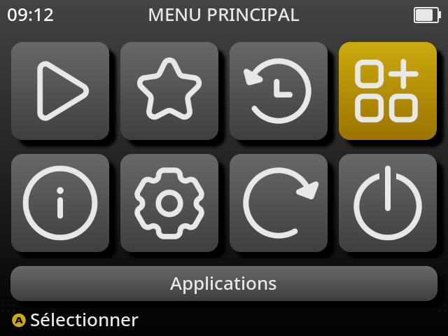
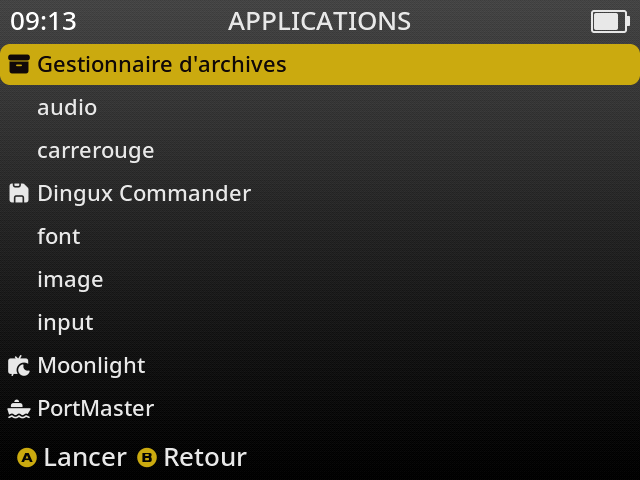

# Running an Application on muOS

## Connect to the RG40XX H using SSH

Before copying or launching an application, connect to the console using SSH.

Example:

```bash
ssh root@192.168.1.203
```

Replace `192.168.1.203` with the IP address of your RG40XX H.

Default credentials:

| Parameter | Value |
|----------|-------|
| User | `root` |
| Password | `root` |

Once connected, you can manage files directly from the Linux command line.

```bash
The authenticity of host '192.168.1.203 (192.168.1.203)' can't be established.
ED25519 key fingerprint is SHA256:8F1DEOZ+8BbW3J0favILjmdhgUg3430Q2gCv3fuZb8Y.
This key is not known by any other names.
Are you sure you want to continue connecting (yes/no/[fingerprint])? yes
Warning: Permanently added '192.168.1.203' (ED25519) to the list of known hosts.
root@192.168.1.203's password: 
Welcome to muOS 2601.0 JACARANDA
----------------
root@muos-942013                                                                                                              ⠀⠀⠀⠀⠀⠀⠀⠀⠀⠀⠀⢀⣤⣶⣾⣷⣶⣤⡀⠀⠀⠀⠀⠀⠀⠀⠀⠀⠀⠀
----------------                                                                                                              ⠀⠀⠀⠀⠀⠀⠀⠀⠀⣠⣶⣿⣿⣿⠿⠿⣿⣿⣿⣦⣀⠀⠀⠀⠀⠀⠀⠀⠀⠀
OS: MustardOS 2601.0 (JACARANDA) aarch64                                                                                      ⠀⠀⠀⠀⣀⣤⣤⣶⣾⣿⣿⣿⠟⠁⠀⠀⠈⠻⣿⣿⣿⣷⣶⣤⣄⡀⠀⠀⠀⠀
Kernel: Linux 4.9.170                                                                                                         ⠀⠀⣠⣾⣿⣿⣿⣿⡿⠟⠋⠀⠀⠀⠀⠀⠀⠀⠀⠙⠻⠿⣿⣿⣿⣿⣷⣄⠀⠀
Uptime: 8 mins                                                                                                                ⠀⢠⣿⣿⣿⠋⠉⠀⠀⠀⠀⠀⠀⠀⠀⠀⠀⠀⠀⠀⠀⠀⠀⠈⠙⣿⣿⣿⡀⠀
Terminal: /dev/pts/0                                                                                                          ⠀⠸⣿⣿⣿⠀⠀⠀⠀⣿⡿⢷⣄⡀⠀⠀⠀⣠⡾⢿⣿⠀⠀⠀⠀⣿⣿⣿⠁⠀
                                                                                                                              ⠀⠀⢿⣿⣿⡆⠀⠀⠀⣭⡅⢰⣝⢿⣦⣠⡾⣋⡴⢨⣭⠀⠀⠀⢠⣿⣿⡿⠀⠀
CPU: sun50iw9p1 (4) @ 1.51 GHz                                                                                                ⠀⠀⢸⣿⣿⡇⠀⠀⠀⣛⡃⠈⠻⢷⣌⣫⣾⠟⠁⢘⣛⠀⠀⠀⢸⣿⣿⡇⠀⠀
Memory: 154.71 MiB / 973.27 MiB (16%)                                                                                         ⠀⠀⣾⣿⣿⠇⠀⠀⠀⠛⠃⠀⠀⠀⠙⠛⠁⠀⠀⠘⠛⠀⠀⠀⠘⣿⣿⣧⠀⠀
                                                                                                                              ⠀⢰⣿⣿⣿⠀⠀⠀⠀⣿⡇⠀⠀⠀⠀⠀⠀⠀⠀⢸⣿⠀⠀⠀⠀⢿⣿⣿⠀⠀
Disk (/): 2.55 GiB / 7.80 GiB (33%) - ext4                                                                                    ⠀⠘⣿⣿⣿⣄⡀⠀⠀⠀⠀⠀⠀⠀⠀⠀⠀⠀⠀⠀⠀⠀⠀⢀⣠⣾⣿⣿⠀⠀
Disk (/mnt/boot): 1.87 MiB / 127.73 MiB (1%) - vfat [Read-only]                                                               ⠀⠀⠙⢿⣿⣿⣿⣿⣶⣦⣄⠀⠀⠀⠀⠀⠀⠀⠀⣠⣴⣶⣿⣿⣿⣿⡿⠃⠀⠀
Disk (/mnt/mmc): 747.38 MiB / 50.09 GiB (1%) - exfat [Read-only]                                                              ⠀⠀⠀⠀⠉⠙⠛⠿⢿⣿⣿⣷⣤⡀⠀⠀⢀⣠⣾⣿⣿⡿⠟⠛⠉⠁⠀⠀⠀⠀
                                                                                                                              ⠀⠀⠀⠀⠀⠀⠀⠀⠀⠉⠻⣿⣿⣿⣶⣶⣿⣿⣿⠟⠁⠀⠀⠀⠀⠀⠀⠀⠀⠀
Local IP (wlan0): 192.168.1.203/24                                                                                            ⠀⠀⠀⠀⠀⠀⠀⠀⠀⠀⠀⠈⠛⠿⠿⠿⠿⠛⠁⠀⠀⠀⠀⠀⠀⠀⠀⠀⠀⠀
Battery: 88% (8 hours, 5 mins remaining) [Discharging]
Gamepad: muOS-Keys
```

---

# Adding a Custom Application to muOS (2601.0 JACARANDA / 2606.0 ANDROMEDA)

## Principle

muOS always starts applications through a launcher script named `mux_launch.sh`.

This script automatically prepares:

- the CPU governor;
- the SDL environment;
- the HOME directory;
- SD1 / SD2 storage management;
- process monitoring;
- cleanup after the application exits.

**Never launch the executable directly from the frontend.**

The official muOS documentation describing the application launcher can be found here:

https://community.muos.dev/t/application-runner/1282

---

## Application directory structure

Create the following directory:

```text
application/
└── my_application/
    ├── mux_launch.sh
    ├── my_executable
    ├── mux_lang.ini        (optional)
    └── glyph/
        └── my_icon.png     (optional)
```

Applications must always be installed in:

```text
/run/muos/storage/application/my_application
```

Never use:

```text
/mnt/mmc
/mnt/sdcard
```

These paths are not compatible with every SD1 / SD2 configuration.

---

## Example of mux_launch.sh

```sh
#!/bin/sh

# HELP: My custom application
# ICON: my_icon
# GRID: My Application

. /opt/muos/script/var/func.sh

APP_BIN="my_executable"
SETUP_APP "$APP_BIN" ""

# Optional:
# SETUP_STAGE_OVERLAY

cd /run/muos/storage/application/my_application

./$APP_BIN
```

---

## Make the files executable

On your Linux PC:

```bash
chmod +x mux_launch.sh
chmod +x my_executable
```

---

## Copy the application to the RG40XX H

Once the executable has been compiled (`make arm64`) and the launcher script is ready, copy the application directory to the console using `scp`.

Example:

```bash
scp -r my_application root@192.168.1.203:/run/muos/storage/application/
```

After the transfer is complete, the application will automatically appear in the **Applications** menu of muOS.

```bash
[~]# cd /
[/]# ls
bin         init        linuxrc     opt         run         usr
dev         lib         lost+found  proc        sbin        var
etc         lib32       media       roms        sys
home        lib64       mnt         root        tmp
[/]# cd mnt/mmc/MUOS/application/
[/mnt/mmc/MUOS/application]# ls
audio       carrerouge  controller  font        image       input
[/mnt/mmc/MUOS/application]# cd carrerouge/
[/mnt/mmc/MUOS/application/carrerouge]# ls
carrerouge-arm64  mux_launch.sh
[/mnt/mmc/MUOS/application/carrerouge]# 
```

---

## Custom icon

Create:

```text
my_application/glyph/my_icon.png
```

The icon name must match the value used in:

```sh
# ICON: my_icon
```
---





---

## Stopping a crashed application

If your application crashes or becomes unresponsive, you can terminate it from an SSH session.

First, display the running processes:

```bash
ps | grep carrerouge
```

Example:

```text
4665 root     {mux_launch.sh} /bin/sh /mnt/mmc/MUOS/application/carrerouge/mux_launch.sh /mnt/mmc/MUOS/application/carrerouge
4699 root     ./carrerouge-arm64
4947 root     grep carrerouge
```

You can also retrieve the application's Process ID (PID) directly:

```bash
pidof carrerouge-arm64
```

Example:

```text
4699
```

Terminate the application using its PID:

```bash
kill 4699
```

Or, more conveniently:

```bash
kill $(pidof carrerouge-arm64)
```

Only the application is terminated. The `mux_launch.sh` launcher exits automatically once the executable has stopped.


---

## Summary

To run a custom application on the RG40XX H with muOS:

1. Connect to the console using SSH.
2. Copy the application directory to:

```text
/run/muos/storage/application/
```

3. Ensure that both the executable and `mux_launch.sh` have execute permissions.
4. Launch the application from the **Applications** menu in muOS.

`mux_launch.sh` is the mandatory entry point used by muOS. It prepares the execution environment, configures SDL, manages storage paths, and starts the ARM64 executable correctly.

If the application crashes or becomes unresponsive, connect through SSH and terminate it with:

```bash
kill $(pidof your_application)
```

This avoids rebooting the console and allows you to quickly test a new version of your application.


