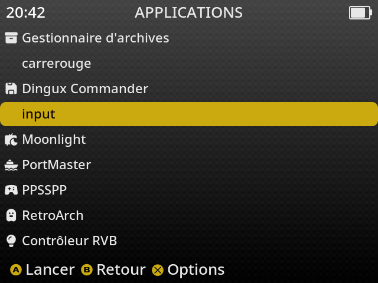

# Controller Example

The following chapter explains the source code of the example program located in:

```text
anbernic/src/controller
```

# Reading the Controller Inputs

Linux exposes all controller events through the **Input Event Interface** (`evdev`).

On the RG40XX H, the gamepad is available as:

```text
/dev/input/event1
```

Every button press, button release, D-Pad movement, or analog stick movement generates an **input event** that can be read by an application.

The example program simply opens this device and continuously reads the generated events.

---

# Opening the input device

```c
int fd = open("/dev/input/event1", O_RDONLY);
```

This instruction opens the controller device in **read-only** mode.

- `"/dev/input/event1"` is the Linux input device associated with the controller.
- `O_RDONLY` means that the application only reads events and never modifies the device.

If the call succeeds, `fd` contains a file descriptor that can be used with the standard Linux `read()` function.

If the device cannot be opened, `open()` returns `-1`.

```c
if (fd < 0)
{
    perror("open");
    return 1;
}
```

---

# Reading controller events

Linux sends every event as a `struct input_event`.

```c
struct input_event ev;

read(fd, &ev, sizeof(ev));
```

Each event contains:

| Field | Description |
|--------|-------------|
| `type` | Event type (button, axis, etc.) |
| `code` | Button or axis identifier |
| `value` | Current value |

The program continuously waits for new events:

```c
while (1)
{
    read(fd, &ev, sizeof(ev));
}
```

This loop never consumes CPU while idle because `read()` blocks until a new event is available.

---

# Event types

The program handles two kinds of events.

| Event type | Meaning |
|------------|---------|
| `EV_KEY` | Buttons |
| `EV_ABS` | D-Pad and analog sticks |

---

# Button events (EV_KEY)

When a button changes state, Linux generates an `EV_KEY` event.

The example converts the numeric button code into a readable name using:

```c
button_name(ev.code)
```

The value indicates the button state:

| Value | Meaning |
|------:|---------|
| 0 | Released |
| 1 | Pressed |

Example output:

```text
A PRESSED
A RELEASED
START PRESSED
START RELEASED
```

---

# D-Pad events (EV_ABS)

The D-Pad is **not** reported as buttons.

It is exposed as two axes.

| Axis | Code | Values |
|------|-----:|--------|
| Horizontal | 16 | -1 = Left, 0 = Center, 1 = Right |
| Vertical | 17 | -1 = Up, 0 = Center, 1 = Down |

Example:

```text
DPAD LEFT
DPAD X CENTER

DPAD UP
DPAD Y CENTER
```

---

# Analog sticks

The analog sticks generate continuous values.

## Left stick

| Axis | Code | Range |
|------|-----:|----------------|
| X | 2 | -4096 ... +4096 |
| Y | 3 | -4096 ... +4096 |

## Right stick

| Axis | Code | Range |
|------|-----:|----------------|
| X | 4 | -4096 ... +4096 |
| Y | 5 | -4096 ... +4096 |

Typical values:

```text
0          -> centered

-4096      -> full left / full up

+4096      -> full right / full down
```

Example output:

```text
LEFT STICK X = -2750
LEFT STICK Y =  1024

RIGHT STICK X = 4096
RIGHT STICK Y =    0
```

---

# Avoiding duplicate events

Some analog devices repeatedly report the same value.

To avoid printing identical values continuously, the program stores the previous value of every axis.

```c
if (last_abs[ev.code] == ev.value)
    break;

last_abs[ev.code] = ev.value;
```

Only value changes are displayed.

---

# Button reference

| Button | Linux code |
|---------|-----------:|
| A | 304 |
| B | 305 |
| Y | 306 |
| X | 307 |
| L1 | 308 |
| R1 | 309 |
| SELECT | 310 |
| START | 311 |
| L2 | 314 |
| R2 | 315 |
| MENU | 354 |

---

# D-Pad reference

| Direction | Code | Value |
|------------|-----:|------:|
| Left | 16 | -1 |
| Center X | 16 | 0 |
| Right | 16 | 1 |
| Up | 17 | -1 |
| Center Y | 17 | 0 |
| Down | 17 | 1 |

---

# Analog stick reference

| Stick | Axis | Code | Range |
|--------|------|-----:|----------------|
| Left | X | 2 | -4096 ... +4096 |
| Left | Y | 3 | -4096 ... +4096 |
| Right | X | 4 | -4096 ... +4096 |
| Right | Y | 5 | -4096 ... +4096 |

---

# Event processing flow

```text
open("/dev/input/event1")
           │
           ▼
     wait for event
           │
           ▼
read(struct input_event)
           │
           ▼
     ev.type ?
      │          │
      │          │
   EV_KEY     EV_ABS
      │          │
      ▼          ▼
 Button      D-Pad / Stick
      │          │
      └──────┬───┘
             ▼
      Process event
             ▼
       Display result
             ▼
     Wait for next event
```

---



---
# Summary

The Linux **evdev** interface provides direct access to every controller event through `/dev/input/event1`.

Each input generates a `struct input_event` containing:

- the event type (`EV_KEY` or `EV_ABS`);
- the button or axis code;
- its current value.

Buttons generate **pressed** and **released** events, while the D-Pad and analog sticks generate **axis values**.

This interface is low-level, lightweight, and fast, making it the preferred method for reading controller input on the RG40XX H under muOS.
