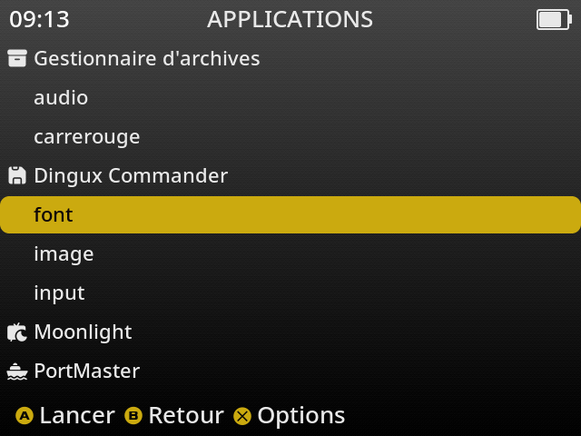

# Image and Text Rendering Example

The following chapter explains the source code of the example program located in:

```text
anbernic/src/font
```

This example extends the previous PNG viewer by adding **text rendering** using the **SDL2_ttf** library.

The application:

- initializes SDL2;
- initializes SDL2_image;
- initializes SDL2_ttf;
- loads a PNG image;
- loads a TrueType font;
- renders a text into a texture;
- displays both the image and the text;
- waits until the **MENU** button is pressed before exiting.

Unlike the previous example, this program introduces **SDL2_ttf**, an SDL extension library that allows rendering TrueType fonts. SDL2_ttf is built on top of the FreeType and HarfBuzz libraries.
---


---
# Initializing SDL2_ttf

Before using any font function, SDL2_ttf must be initialized.

```c
TTF_Init();
```

If the initialization fails, no text can be rendered.
---

# Loading a TrueType font

A font is loaded using:

```c
TTF_Font *font =
    TTF_OpenFont(
        "/usr/share/fonts/liberation/LiberationSans-Regular.ttf",
        48);
```

The first parameter is the font filename.

The second parameter is the font size (48 points in this example).

---

# Fonts available on the RG40XX H

muOS already provides several TrueType fonts.

### Liberation fonts

```text
/usr/share/fonts/liberation/LiberationSans-Regular.ttf
/usr/share/fonts/liberation/LiberationSans-Bold.ttf
/usr/share/fonts/liberation/LiberationSans-Italic.ttf
/usr/share/fonts/liberation/LiberationSans-BoldItalic.ttf

/usr/share/fonts/liberation/LiberationSerif-Regular.ttf
/usr/share/fonts/liberation/LiberationSerif-Bold.ttf
/usr/share/fonts/liberation/LiberationSerif-Italic.ttf
/usr/share/fonts/liberation/LiberationSerif-BoldItalic.ttf

/usr/share/fonts/liberation/LiberationMono-Regular.ttf
/usr/share/fonts/liberation/LiberationMono-Bold.ttf
/usr/share/fonts/liberation/LiberationMono-Italic.ttf
/usr/share/fonts/liberation/LiberationMono-BoldItalic.ttf
```

### Noto fonts

```text
/usr/share/fonts/truetype/noto/NotoSansJP-VF.ttf
/usr/share/fonts/truetype/noto/NotoSansKR-VF.ttf
/usr/share/fonts/truetype/noto/NotoSansSC-VF.ttf
/usr/share/fonts/truetype/noto/NotoSansTC-VF.ttf
/usr/share/fonts/truetype/noto/NotoSansHK-VF.ttf
```

You can use any of these fonts by providing its full pathname to `TTF_OpenFont()`.

---

# Changing the font style

The example enables the **bold** style.

```c
TTF_SetFontStyle(font, TTF_STYLE_BOLD);
```

Other available styles include:

- Normal
- Bold
- Italic
- Underline
- Strikethrough

Several styles can also be combined.

---

# Choosing the text color

Text color is defined using an SDL color structure.

```c
SDL_Color red =
{
    255,
    0,
    0,
    255
};
```

The four values represent:

- Red
- Green
- Blue
- Alpha (opacity)

---

# Rendering the text

The text is rendered into an SDL surface.

```c
TTF_RenderUTF8_Blended(
    font,
    "Test",
    red);
```

The **Blended** renderer produces high-quality anti-aliased text.

The generated surface is then converted into an SDL texture.

```c
SDL_CreateTextureFromSurface(...)
```

---

# Positioning the text

The destination rectangle determines where the text appears.

```c
txtRect.x = 20;
txtRect.y = 20;
```

The width and height are automatically obtained from the generated surface.

```c
txtRect.w = txtSurface->w;
txtRect.h = txtSurface->h;
```

---

# Rendering

Rendering is performed in three steps.

First, clear the screen.

```c
SDL_RenderClear(renderer);
```

Draw the PNG image.

```c
SDL_RenderCopy(renderer,
               tex,
               NULL,
               NULL);
```

Draw the text.

```c
SDL_RenderCopy(renderer,
               txtTexture,
               NULL,
               &txtRect);
```

Finally, display everything.

```c
SDL_RenderPresent(renderer);
```

The text is rendered **on top of the PNG image**.

---

# Waiting for the MENU button

As in the previous example, the application waits until the MENU button is pressed.

```c
open("/dev/input/event1", O_RDONLY);
```

When button **354** is received, the application exits.

---

# Cleaning up

Before terminating, every allocated object is released.

```c
SDL_DestroyTexture(txtTexture);
SDL_DestroyTexture(tex);

TTF_CloseFont(font);

SDL_DestroyRenderer(renderer);
SDL_DestroyWindow(window);

TTF_Quit();
IMG_Quit();
SDL_Quit();
```

---

# The Makefile

This example introduces a third SDL extension library:

- SDL2
- SDL2_image
- SDL2_ttf

## PC compilation

Using `pkg-config`:

```make
pkg-config --cflags sdl2 SDL2_image SDL2_ttf

pkg-config --libs sdl2 SDL2_image SDL2_ttf
```

`pkg-config` automatically retrieves every include directory and every required library.

---

## ARM64 compilation

For the RG40XX H, more libraries must be linked.

```make
LIBS_ARM64 = \
    -lSDL2_ttf \
    -lSDL2_image \
    -lSDL2 \
    -lharfbuzz \
    -lfreetype \
    -lpng16 \
    -lbz2 \
    -lbrotlidec \
    -lbrotlicommon \
    -lglib-2.0 \
    -lpcre2-8 \
    -lz
```

Unlike SDL2_image, **SDL2_ttf has several dependencies**.

These libraries provide:

| Library | Purpose |
|---------|---------|
| SDL2_ttf | Text rendering API |
| SDL2_image | PNG image loading |
| SDL2 | Graphics and rendering |
| FreeType | Reads TrueType font files |
| HarfBuzz | Advanced text shaping and Unicode support |
| libpng | PNG image decoding |
| zlib | Data decompression |
| bzip2 | Compression support |
| Brotli | Font compression support |
| glib | Utility library used by HarfBuzz |
| PCRE2 | Regular expression support used internally by HarfBuzz |

Because SDL2_ttf relies on FreeType and HarfBuzz, all these libraries must be linked when building the ARM64 executable.

---

# Compilation

Compile for the PC:

```bash
make pc
```

Compile for the RG40XX H:

```bash
make arm64
```
---



---

# Summary

This example combines the three main SDL libraries:

- **SDL2** for graphics.
- **SDL2_image** for loading PNG files.
- **SDL2_ttf** for rendering TrueType fonts.

The application displays a background image, renders a bold red text over it, waits for the MENU button, then releases every allocated resource before terminating.

It also demonstrates how SDL2_ttf depends on several additional libraries such as FreeType and HarfBuzz when compiling for the ARM64 platform.
