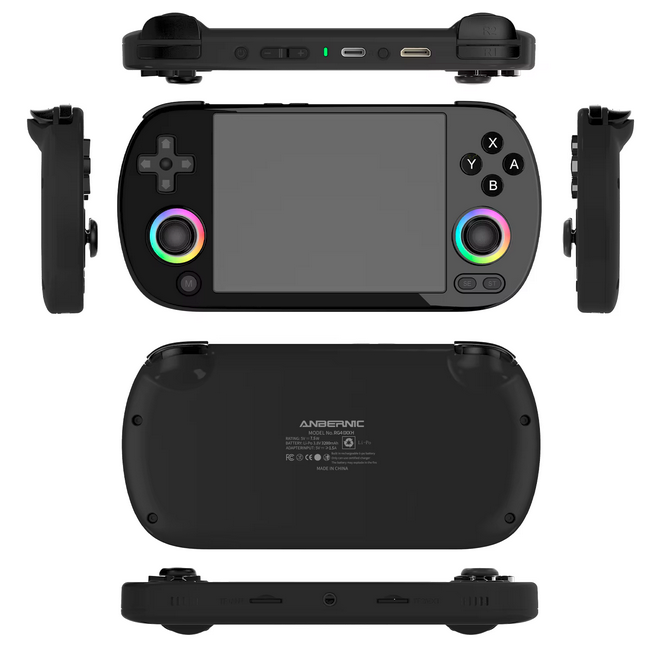

# Programming the Anbernic RG40XX H with SDL2

## Introduction

This project is a practical introduction to native application development for the **Anbernic RG40XX H** handheld console using **SDL2**.

Although primarily designed for retro gaming, the [RG40XX H](https://fr.aliexpress.com/item/1005012030722515.html) is a capable Linux-based ARM64 computer featuring a quad-core Cortex-A53 processor, a 640×480 IPS display, Wi-Fi, Bluetooth, HDMI output, and hardware-accelerated graphics. These features make it an excellent platform for developing emulators, games, multimedia applications, and embedded graphical software.

This tutorial explains how to set up a development environment on a Linux PC, write a first SDL2 application, cross-compile it for the RG40XX H, and run it directly on the console.

---
# Menu

# Menu

1. [Installing the Compiler on the PC](01-installation-compilateur.md)
2. [Using muOS](02-utilisation-muos.md)
3. [Compilation](03-compilation.md)
4. [Running the Program in muOS](04-execution-muos.md)
5. [Using Buttons and Direction Pad](05-boutons-pad.md)
6. [Displaying an Image](06-affichage-image.md)
7. [Displaying Text](07-affichage-texte.md)
8. [Playing a WAV File](08-lire-wav.md)
9. [Playing an MP3 File](09-lire-mp3.md)
10. [Playing a MOD File](10-lire-mod.md)
---

# Hardware Specifications

| Feature | Specification |
|---------|---------------|
| Display | 4.0" IPS, OCA laminated |
| Resolution | 640 × 480 |
| CPU | Allwinner H700 Quad-Core ARM Cortex-A53 @ 1.5 GHz |
| GPU | Dual-Core Mali G31 MP2 |
| RAM | 1 GB DDR4 |
| Storage | 64 GB microSD (dual microSD slots) |
| Operating System | Linux 64-bit |
| Wireless | Wi-Fi 2.4/5 GHz (802.11 a/b/g/n/ac), Bluetooth 4.2 |
| Battery | 3200 mAh Li-Polymer |
| Battery Life | Up to 6 hours |
| Charging | USB-C (5V / 1.5A, C-to-C supported) |
| HDMI Output | Yes |
| USB Controllers | Wired and 2.4 GHz wireless supported |
| Vibration | Yes |
| RGB Lighting | RGB analog sticks with customizable effects |

---

# Software Environment

The console runs a 64-bit Linux system and is compatible with several custom firmwares such as **muOS**.

Development is performed on a Linux PC (Linux Mint is used throughout this tutorial) using the GNU cross compiler and SDL2.

---

# Useful References

## muOS

https://muos.dev/devices

## SDL2

https://wiki.libsdl.org/

## RG35XX SDL Test Application

https://github.com/CodeAsm/RG35XXH-Testapp

Although written for the RG35XX H, this project is an excellent reference for understanding SDL programming on Anbernic handhelds.

---

# Future Chapters

The next tutorials will cover:

- SDL2 rendering
- Image loading
- Audio playback
- Reading gamepad inputs
- Double buffering
- Sprites and animations
- Building a simple game engine
- Cross-compilation using CMake
- Performance optimization on the H700 processor

